# Expense Analysis #

Expense analysis is a simple Xamarin.Forms application to track the expenses of an individual. It is built using Syncfusion [Xamarin UI components](https://www.syncfusion.com/products/xamarin) and uses [SQLite](https://www.nuget.org/packages/sqlite-net-pcl/) for local database storage. This project uses the following patterns and features:

* XAML UI
* Converters
* Custom controls
* Data binding
* Behaviors
* MVVM
* Styles
* Phone, tablet and desktop layout
* Local database storage

This project uses the following Syncfusion controls,

1. [Charts](https://www.syncfusion.com/products/xamarin/charts)
2. [DataGrid](https://www.syncfusion.com/products/xamarin/datagrid)
3. [ListView](https://www.syncfusion.com/products/xamarin/listview)
4. [Data form](https://www.syncfusion.com/products/xamarin/data-form)
5. [Auto complete](https://www.syncfusion.com/products/xamarin/autocomplete)
6. [Numeric text box](https://www.syncfusion.com/products/xamarin/numerictextbox)

## Key features ##

1. View budget.
2. Add new expenses.
3. View the overview of expenses and its details.
4. View the expense by category and date. 
5. Analyze the trends of the current year’s expenses with charts. 

## Screens ##

**Android**

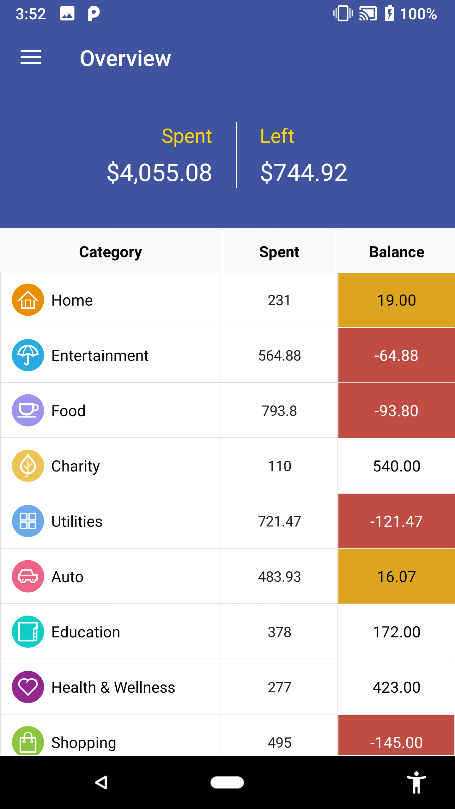 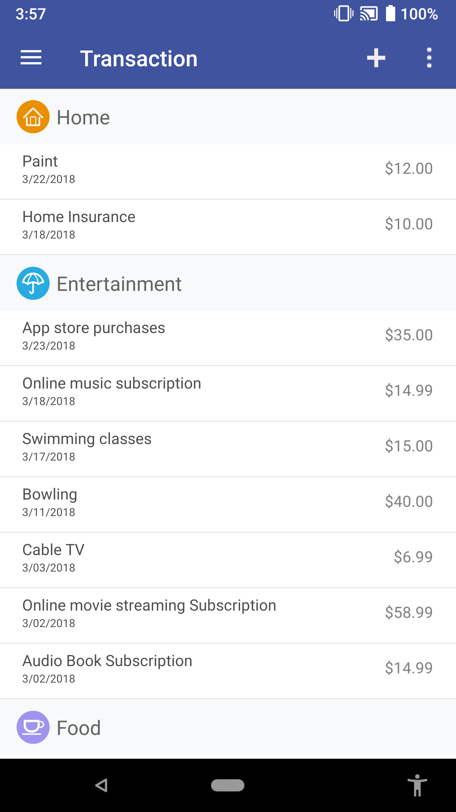 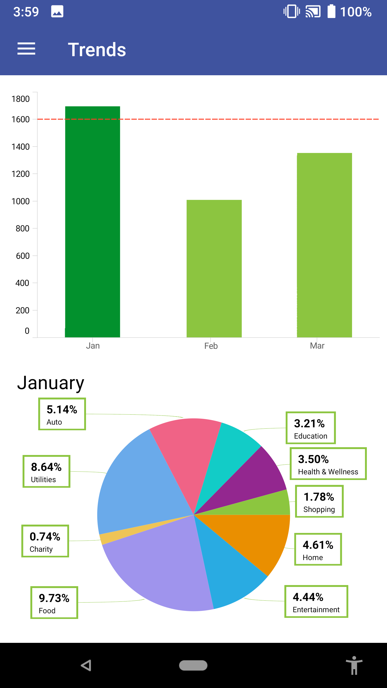 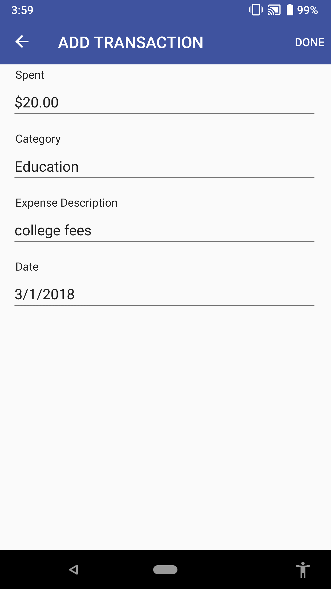

**iOS**

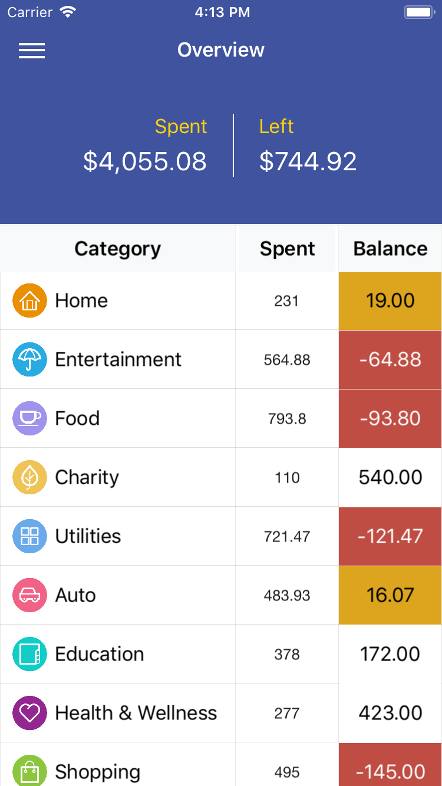 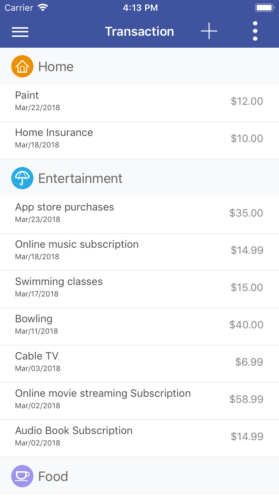 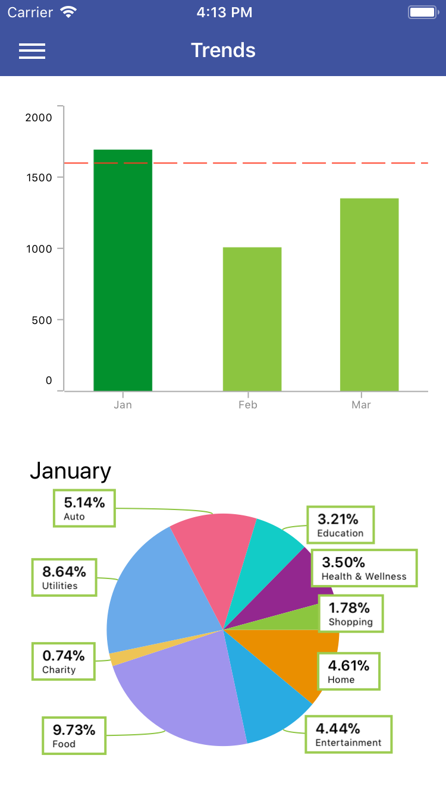 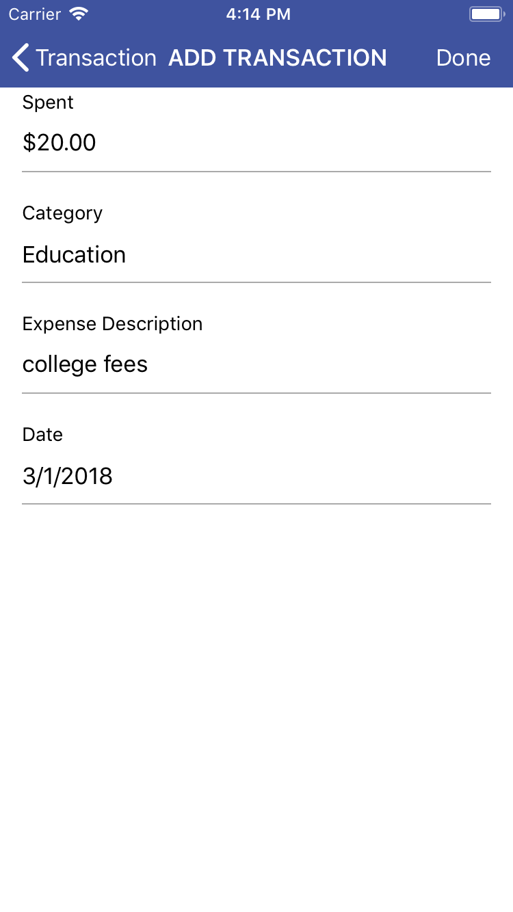

**UWP**

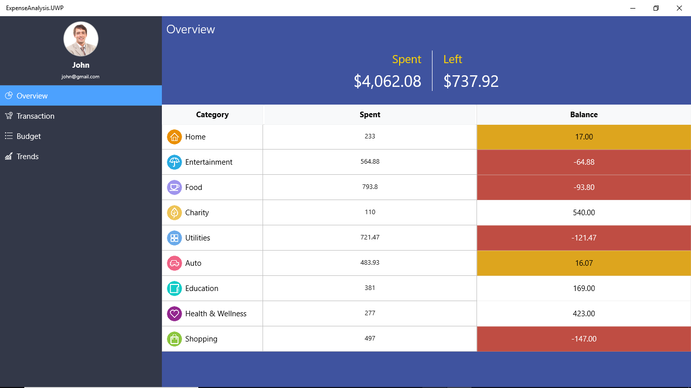 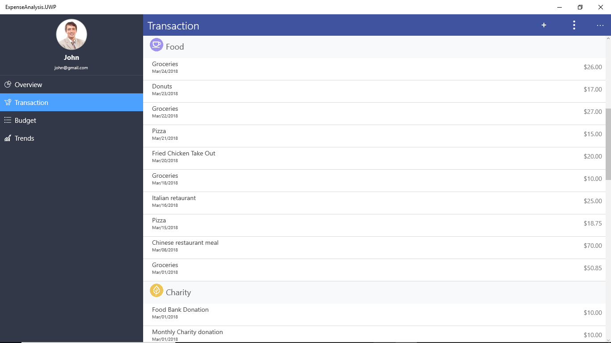 
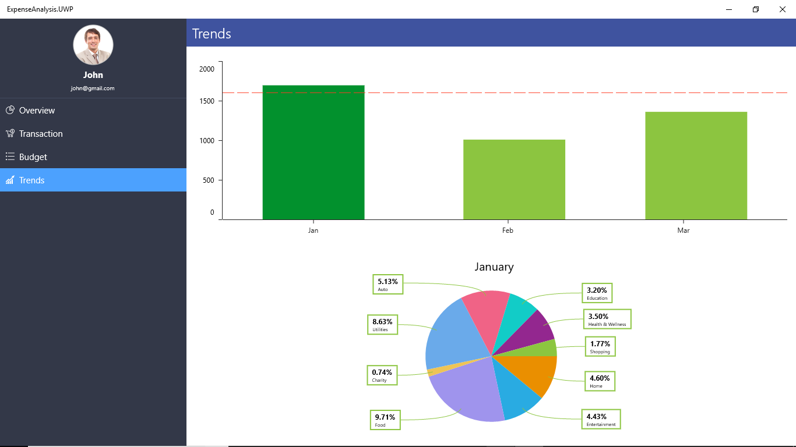

**macOS**

 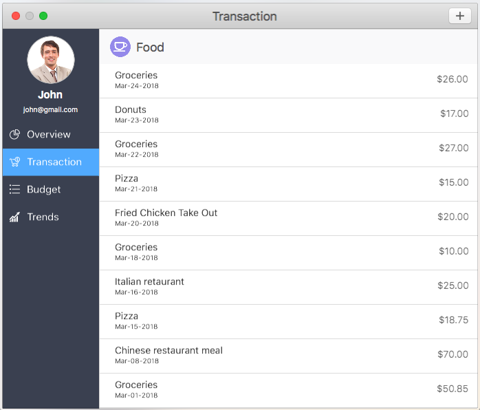 

## Supported platforms: ##

| Platforms | Supported versions |
| --------- | ------------------ |
| Android   | API level 19 and later versions |
| iOS | iOS 9.0 and later versions |
| UWP | Windows 10 devices |
| macOS | macOS 10.11 and later versions |

Please refer to the link for more information:

<https://help.syncfusion.com/xamarin/installation-and-upgrade/system-requirements>

## Requirements to run the demo ##

* [Visual Studio 2017](https://visualstudio.microsoft.com/downloads/) or [Visual Studio for Mac](https://visualstudio.microsoft.com/vs/mac/).
* Xamarin add-ons for Visual Studio (available via the Visual Studio installer).

## How to run the sample ##
  
  
1. Clone the sample and open it in Visual Studio.

   *Note: If you download the sample using the "Download ZIP" option, right-click it, select Properties, and then select Unblock.*

2. Register your license key in App.cs as shown below.

        public App()
        {
            //Register Syncfusion license
            Syncfusion.Licensing.SyncfusionLicenseProvider.RegisterLicense("YOUR LICENSE KEY");

            InitializeComponent();

            MainPage = new MasterDetail();
        } 

   Refer this [link](https://help.syncfusion.com/common/essential-studio/licensing/license-key#xamarinforms) for more information.

3. Set any one of the platform specific projects (iOS, Android, UWP, macOS) as a startup project.
4. Clean and build the application.
5. Run the application.

## License ##

Syncfusion has no liability for any damage or consequence that may arise by the use or viewing of the samples. The samples are for demonstrative purposes and if you choose to use or access the samples you agree to not hold Syncfusion liable, in any form, for any damage that is related to use, accessing or otherwise viewing the samples. By accessing, viewing, or otherwise seeing the samples you acknowledge and agree Syncfusion’s samples will not allow you to seek injunctive relief in any form for any claim related to the sample. If you do not agree to this, do not view, access, utilize or otherwise do anything with Syncfusion’s samples.

## Support and feedback ##

* For using the Syncfusion controls, refer the following User Guide links.

   * [Xamarin.Forms](https://help.syncfusion.com/xamarin/introduction/overview)
   * [Xamarin.Android](https://help.syncfusion.com/xamarin-android/introduction/overview)
   * [Xamarin.iOS](https://help.syncfusion.com/xamarin-ios/introduction/overview)

* For any other queries, reach our [Syncfusion support team](https://www.syncfusion.com/support/directtrac/incidents/newincident) or post the queries through the [community forums](https://www.syncfusion.com/forums).

* To renew the subscription, click [here](https://www.syncfusion.com/sales/products) or contact our sales team at <salessupport@syncfusion.com>.
